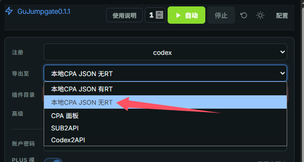
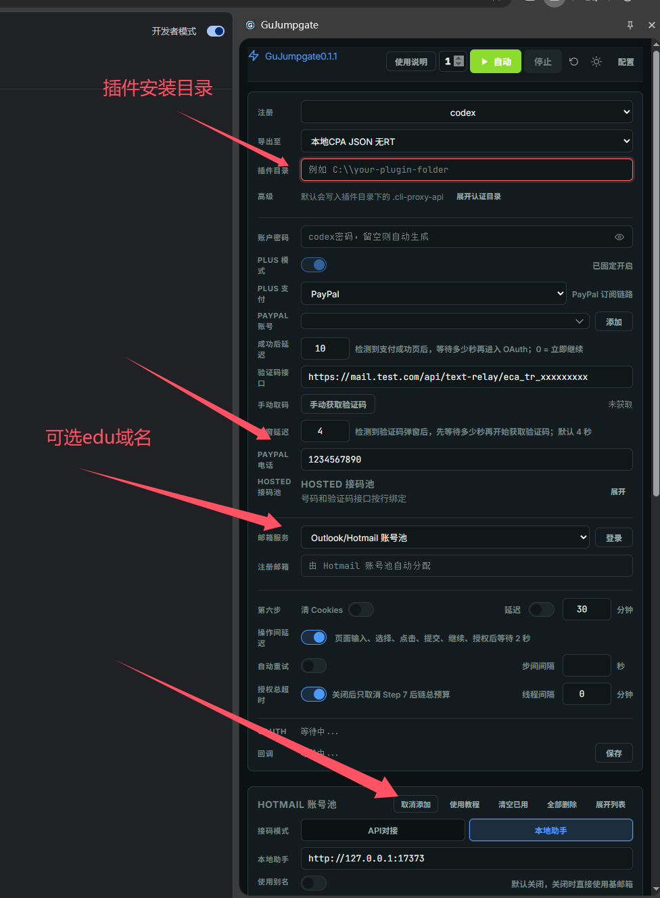

# GuJumpgate

一个也许能“真正解放双手”的全自动 GPT Plus 注册浏览器扩展。

如果能帮上你，欢迎点个 Star⭐。

目前Oauth风控严重，必跳add phone只推荐走无RT的JSON
即选择导出至 本地CPA JSON 无RT

## 已实现能力

1. 自动注册 Free 账号  
   借助 FlowPilot 项目实现 Free 账号的自动注册。

2. PayPal 激活 Plus 全流程  
   - 自动跳转
   - 自动跳转 Stripe 长链接
   - 自动填写 Stripe 账单并跳转 PayPal
   - 自动填写 PayPal 账单并完成流程

   已将此前发布的油猴脚本移植并整合进扩展。

3. Hotmail/Outlook自动别名

4. PayPal号码池

4. 自动 OAuth 回调 到本地及各面板
   对 FlowPilot 原有回调流程做了调整和适配。
5. 支持跳过OAuth，忽略RT生成只有AT的JSON文件到本地

## 前提要求

1. 1 个带 API、且能连续正常接收 PayPal 验证码的 US `+1` 接码手机号
2. 1 个或 N 个支持 `IMAP` 和 `Graph` 的 Outlook 邮箱 或者 自建Cloudflare Temp Email(edu前缀，如edu.openai.com才有试用资格)
3. 1 个或 N 个支持 GPT 注册的 JP 代理，用于批量轮询
4. 1 个相对干净、支持 PayPal 注册的 US 代理 (干净就不会跳PAYPAL的注册滑块，账单页面的Captcha扩展已经设置了自动屏蔽)
5. 1 个支持分流的代理工具(推荐Mihomo)

## 测试环境

- 成功率：连续 10 次串行运行，注册并激活 Plus 100% 成功率
- 浏览器：Chrome `148.0.7778.168`（64 位正式版），开启无痕模式
- 网络环境：JP 万人骑代理轮询 + US 自建代理

## 安装与使用

先到本仓库的 [Releases](https://github.com/FoundZiGu/GuJumpgate/releases)  页面下载扩展压缩包并解压；

### 1. 打开扩展开发者模式

打开 `chrome://extensions/`，开启开发者模式。

### 2. 加载扩展目录

选择“加载已解压的扩展程序”，然后选择刚才解压出的文件夹。

### 3. 启用无痕权限

在扩展详情页中勾选“在无痕模式下启用”，如果你使用`ZeroOmega` 同理。

### 4. 配置代理分流

在代理工具中配置注册、登录、PayPal 和 Stripe 的分流规则。

你可以使用 Mihomo 等支持分流的代理工具，有什么、会什么就用什么。

如果你使用的代理工具是mihomo(clash)，你可以将Releases中的”mihomo-yaml-prompt.md“发给电脑上的claude code、codex、opencode等工具，让AI直接帮你修改分流配置。(推荐、方便)

以下演示使用的代理工具是 [ZeroOmega](https://chromewebstore.google.com/detail/pfnededegaaopdmhkdmcofjmoldfiped?utm_source=item-share-cb)，(麻烦)

### 5. ZeroOmega 导入&配置分流规则 (如果你已经用提示词配置好了mihomo，这里就不用再设置ZeroOmega了)

你可以选择直接导入我的 ZeroOmega 分流配置“ZeroOmegaOptions.bak”，但请注意：所有代理都只是示例值，需要自行修改。

总之，分流规则核心就是：

- 注册走 JP
- 支付走 US

如果你的 CPA 部署在本地，还需要把 CPA 地址设置为直连。

### 6. 启动 Hotmail Helper (如果你使用的是Outlook/Hotmail邮箱)

运行解压目录内的 `start-hotmail-helper.bat`。

### 7. 打开无痕浏览器并切换代理 (如果你已经用提示词配置好了mihomo，这里就不用再设置ZeroOmega了)

启动无痕浏览器，ZeroOmega 选择 `auto switch`。(如果你已经用提示词配置好了mihomo，这里就不用再设置ZeroOmega了)

### 8. 配置扩展参数 (选择导出至哪里)

目前只推荐这个导出方式，Oauth登录严重风控，几乎100%弹出验证手机号

在扩展中打开侧边栏，配置 、接码 API、PayPal 接码电话，并导入 Outlook 邮箱。

### 9. 开始运行

保存配置后即可开始运行。

## 版权与来源说明

本项目基于开源项目 [QLHazyCoder/FlowPilot](https://github.com/QLHazyCoder/FlowPilot) 进行修改、移植与二次开发，其部分早期代码与 [whwh1233/StepFlow-Duck](https://github.com/whwh1233/StepFlow-Duck) 具有共同历史。

原项目及其相关开源部分采用 MIT License 发布。根据 MIT License，你可以在保留原版权声明和许可声明的前提下使用、修改、分发本项目的相关代码。

为避免歧义，原项目作者、历史贡献者与当前二开版本之间不存在默认的认可、担保或背书关系。本项目中新增的适配、流程调整、脚本移植与文档整理内容，除另有说明外，均由当前维护者负责。

如果你分发本项目或其修改版本，请一并保留仓库中的 `LICENSE` 及相关来源说明文件。

## 使用与发布提示

- 发布你自己的二开版本前，建议先检查代码、默认配置与截图中是否包含真实账号、密钥、代理、手机号、邮箱、Cookie 或回调地址
- 若你继续分发本项目或其修改版，请同步保留 `LICENSE` 与 `THIRD_PARTY_NOTICES.md`
- 使用者应自行遵守目标平台服务条款、适用法律及其所在地区的监管要求

## 友情链接

- [LINUX DO - 新的理想型社区](https://linux.do/)
